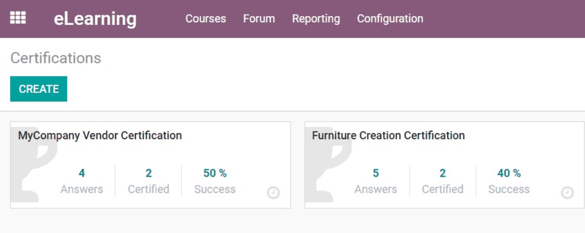
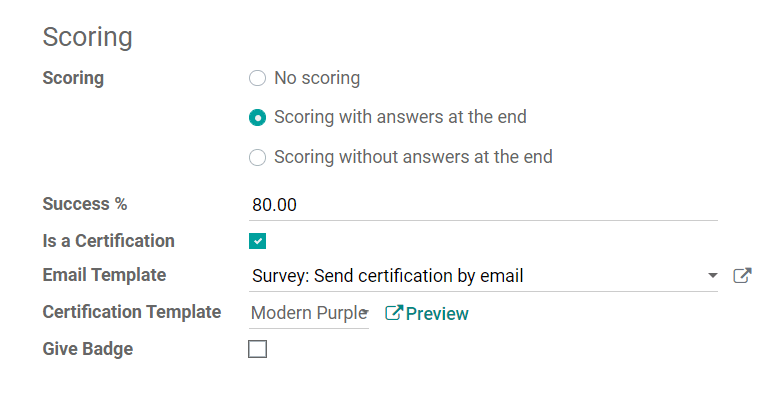
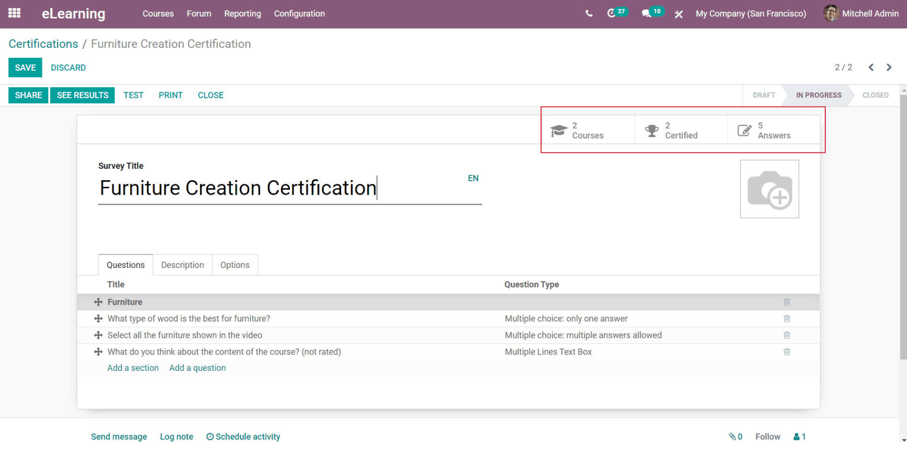
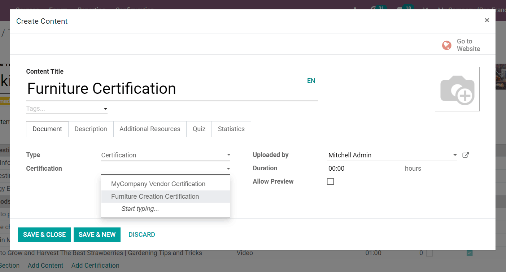
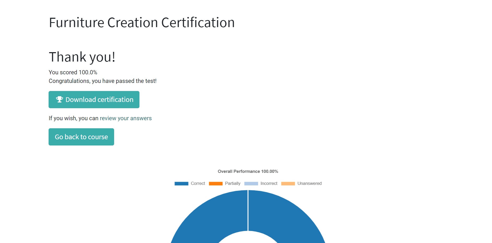

=====================
Create certifications
=====================

Certifications are a great way to reward your most studious participants in your eLearning
courses. Users can place certifications in their eLearning courses as an official way to
"certify" their knowledge and expertise level.

In other words, if you taught an eLearning course on woodworking, you can create a generic
*Furniture Creation Certification* filled with a collection of important questions, and apply it to
any of your courses that cover similar topics. This saves the user time
by allowing them to create numerous certifications, and adhere them to as many courses as they'd
like, without having to recreate new certifications for each course.

Getting started
===============

Click on *Certifications* under the *Courses* menu.

.. image:: ./media/courses-certification.png
   :align: center

Then, click on *Create*.

After titling the certification, users can start adding questions and sections, just like they
would when creating a standard eLearning course (or survey).

.. image:: ./media/courses-certification.png
   :align: center

Users can elaborate on the certification, or offer any additional information, in the Description
tab. In the *Options* tab, users can thoroughly customize their certification. In the *Scoring*
section, users can decide the success percentage needed to "pass" the certification.

They can also modify the email and certification template the participants will see. In addition
to that, users can also choose to activate the "Give Badge" feature, which would reward
participants with a "badge" for successfully completing the certification.

Then, once the user has completed their customizations, they can hit *Save* and the certification
is then finalized, but can be modified at any time.

Also, in the upper-right corner of the certification template, you'll see Smart Buttons for:
*Courses*, *Certified*, and *Answers*.

*Courses* tells the user how many courses are currently featuring this specific certification.
*Certified* tells users how many people have been successfully certified, via this certification.
And, lastly, *Answers* takes the user to a page showcasing all the answers to the certification
questions from each participant.

Applying certification to courses
=================================

Open the template of the course you want to add a certification to, and click on *Add
Certification*. Then, a pop-up will appear, in which users can title the Certification Content in
your course, and then select which Certification you want to apply to your course.

Users can also add an image, *Description*, *Additional Resources*, *Quiz*, as well as view
*Statistics* of the certification.

Certifications in eLearning course
==================================

Once participants encounter the certification in the eLearning course that it's applied to, they
will be presented with a unique "Pass Certification" button.

.. image:: ./media/pass-certification-incourse.png
   :align: center

When pressed, it will take them to a Certification prompt page. Once they are are ready, they can
begin their certification process.

.. image:: ./media/certification-quiz.png
   :align: center

After entering their answers to the certification, participants will be taken to a results page.

Here, they'll see their success percentage, along with a graph, visually representing their
answer attempts. If they pass, they can click on *Download Certification* and have the
certification immediately downloaded onto their computer for reference. They can also revisit the
course by clicking on *Go Back To Course*.
