================
eLearning forums
================

Forums allow participants of courses to interact and engage with one another about the course
material itself. This offers up invaluable insight about how one's courses are actually being
received by participants, which helps the creator of the course know exactly what works (and,
more importantly, what doesn't work).

Participants can ask (and answer) questions with one another, and offer up genuine, honest
feedback about the course material. This level of interaction helps participants retain knowledge
and form connections with their peers.

Getting started
===============

First, users have to activate the *Forum* feature in eLearning Settings (*Configuration* >
*Settings*) and hit *Save*.

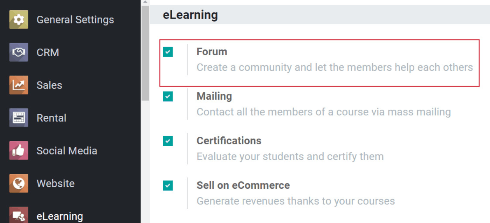

After completing that step, a *Forum* menu option will appear on the header. When it does, the user
can click on *Forums* under that specific drop-down menu.

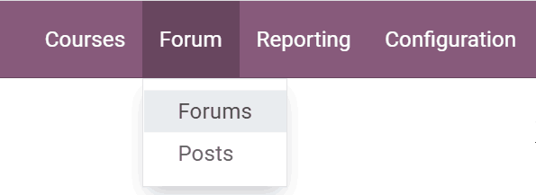

That will take the user to the *eLearning Forums* dashboard.

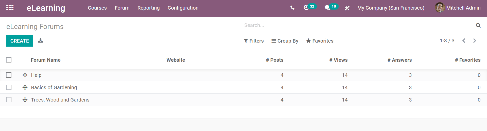

Here, the user will see all the various forums that have been created, along with how many
*Posts*, *Views*, *Answers*, and *Favorites* each forum has at the moment.

When the user is ready, they can click *Create* to build a new forum. Doing so, will take the
user to a blank Forum template.

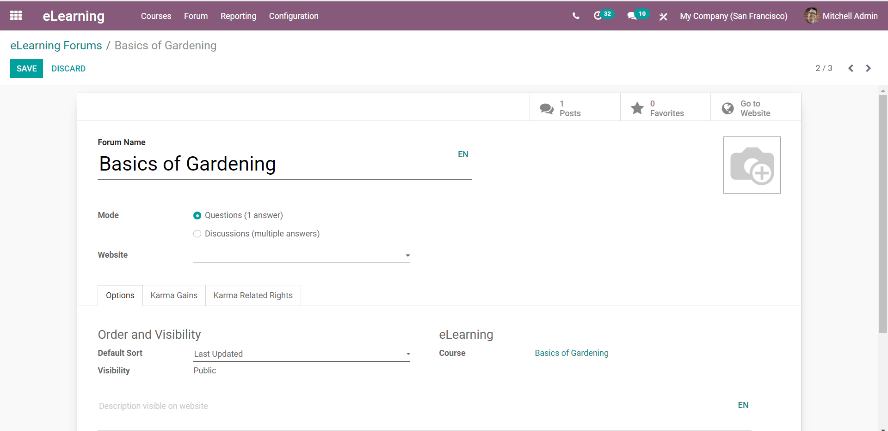

Here, the user would give the forum a specific title and customize it to fit their needs.

Users can decide what mode they would like their forum to be in: *Questions (1 answer)* or
*Discussions (multiple answers)*. Below that, they will be able to decide which website they would
like to apply this forum to, if they are working in a multi-website environment.

Forum tabs
==========

Beneath those fields are the *Options*, *Karma Gains*, and *Karma Related Rights* tabs.

In the *Options* tab, users can decide how they'd like the 'Order and Visibility' to look, and
what course this forum should applied to. Users also have the option to add a description about
the forum in this tab, as well.

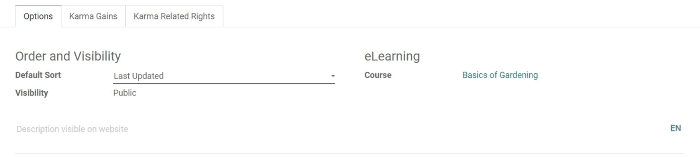

In the *Karma Gains* tab, users can decide how many "Karma Points" they'd like to give people who
participate in the forum.

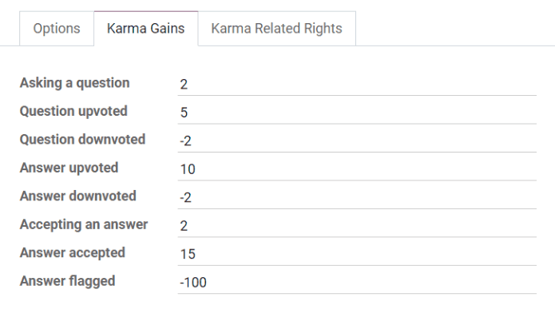

They can modify how many points will be rewarded for a number of different things, such as:
Asking a question, upvoting a question, and accepting an answer. They can also choose to take
away karma points for negative interactions, such as: downvoting a question (or answer) and/or
flagging an answer.

In the *Karma Related Rights* tab, the user will find a similar set of options to designate points
to, however, these are all far more specific to the participants who post and engage in the forum.

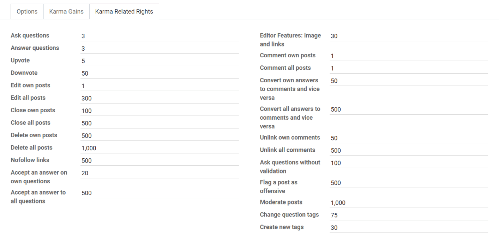

Viewing forums
==============

Once the user has completed their modifications, they can hit *Save* and see what it looks like
to their participants by clicking on the *Go to Website* smart button, located in the upper-right
corner of the forum template. This will take them to their forum on their website.

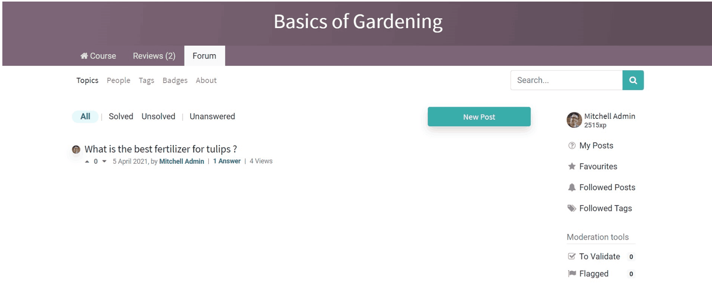

Here, the user can navigate around the forum however they'd like. They can check out *Topics*,
*People*, *Tags*, *Badges*, and *About*. Or, they can see which forum posts have been *Solved*,
*Unsolved*, or *Unanswered*.

Odoo shows *All* posts by default. They also have the option to create a *New Post* on this page,
as well.

When the user clicks *People*, they will be taken to a page showcasing all of the users of the
forum, along with all their ranking, personal statistics, and pertinent information.

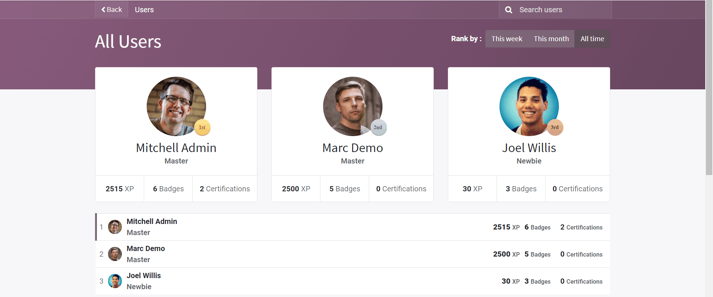

The *Tags* page will allow users to locate certain posts including a specific tag (or keyword). The
*Badges* page will inform users of the various badges they have earned and badges that are
available.

And the *About* page allows the creator of the forum to clearly lay out the guidelines/rules they
would like participants to follow while engaging with the forum.

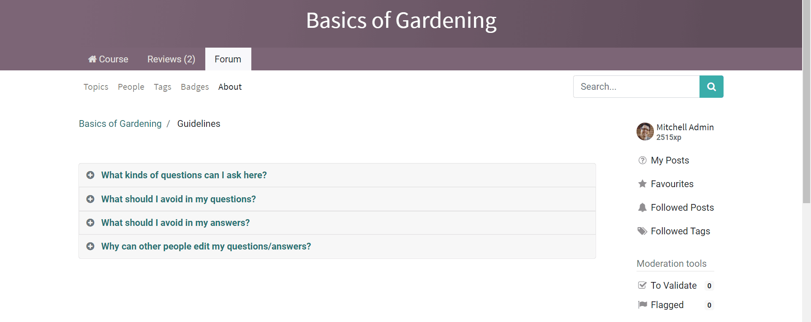

To see the various responses to a post, the user simply needs to click on the title of the post
or on '*Answers*' beneath their desired post, and Odoo will redirect them that specific post's page.

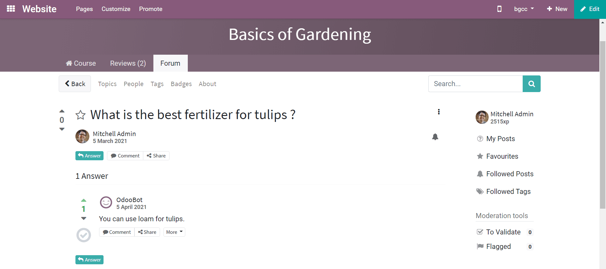

Here, users can see see the question and all the offered answers from participants in the forum.
They can choose to upvote or downvote the question (or answer), as well as offer their own response,
comment, or share the post on their social media.

Under the '*More*' dropdown (found on the answers), users have the option to *Edit*, *Delete*,
*Flag*, or *Convert as a comment*.

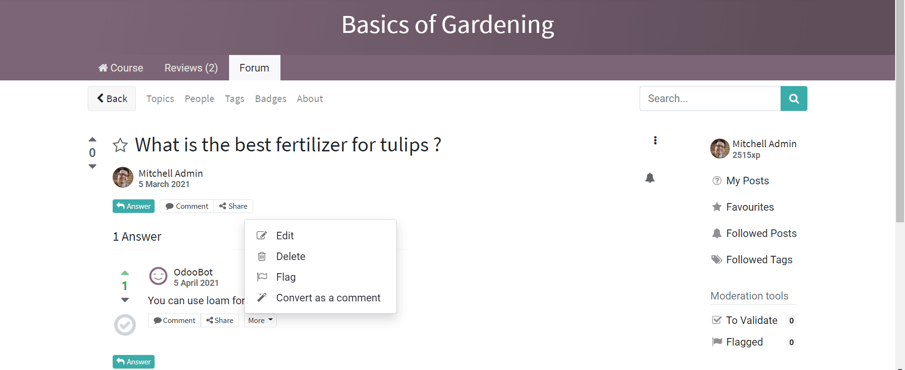

Adding a new post
=================

When users click on "*New Post*," Odoo will redirect the user to a post template page, wherein they
can create a post of their own.

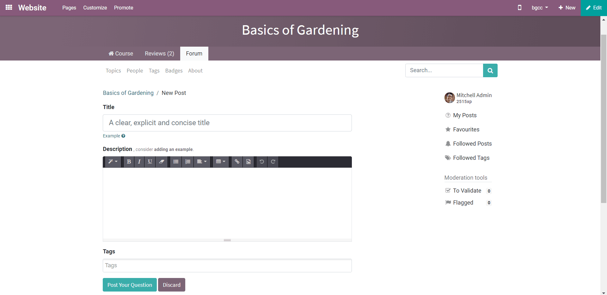

They would enter a title, type their post in the *Description* box, and add any tags they deem
necessary.

Once they're done with that, all they have to do is click on *Post Your Question*, and
their question will immediately be posted on the forum, and all participants will be able to
interact and engage with it.
