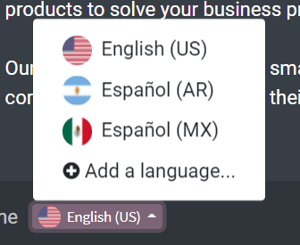
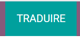
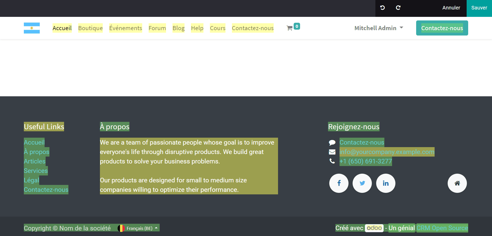

===================
Website translation
===================

Overview
========

In addition to creating beautiful, professional-grade websites, Odoo gives users the
ability to translate it in multiple different languages.

Translate
=========

Once your website is created, you have the opportunity to translate it
in as many different languages as you want.

To do so, simply go to your website, and scroll down to your footer. Then, click on the language
(i.e. English - US) to reveal a menu, and click on *Add a Language*.

Choose the language in which you want to translate your website and then
click on *Add*.

.. image:: media/translate_website02.png
    :align: center

Then, once you navigate back to your website, you will see that, next to your initial language,
there is also French (for example), which means *that* language translation for this page has
been created. When selected, you'll see that some of the text has been translated automatically.

.. image:: media/translate_website03.png
    :align: center

To translate the content of the website, click on **Translate** (here
**Traduire** since we want to translate the website in French).

Now, you can see most of the content is highlighted in yellow or green. The yellow represents the
content that you have to translate manually. The green represents the content that has already
been translated for you automatically.

